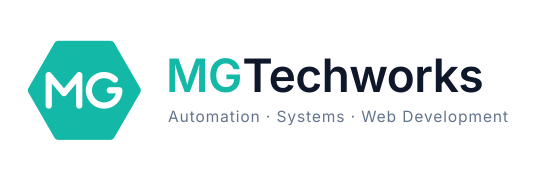

  <picture>
    <source media="(prefers-color-scheme: dark)" srcset="assets/logo-horizontal-dark.svg">
    
  </picture>

    Hi, and Welcome! I'm <b>Gyula Mihalykovics</b>, a passionate developer focused on reporting, interfaces and automation from <b>Hungary</b>,
    currently living in <b>Graz, Austria</b>. 
    

<h3>Things I do</h3>

- 🔧 I build under the **MG Techworks** umbrella — automation, systems and web

- 🔭 I’m currently working on **a reporting and analytics platform for railway operations**

- 🌱 I’m currently learning **Power BI, DAX and API design**

- 💬 Ask me about **PHP, Excel automation, reporting and system interfaces**

- 📫 How to reach me: **mg-techworks@proton.me**

<h3>Things I work with</h3>

    
    
    
    
    
    
    
    
    
    

<h3>Databases &amp; reporting</h3>

    
    
    
    
    
    
    
    
    

<h3>Automation &amp; administration</h3>

    
    
    
    
    
    
    
    
    
    
    
    
    
    

<h3>Schnittstellen — APIs &amp; integrations</h3>

    
    
    
    
    
    
    
    
    
    

<h3>Where to find me</h3>

    
    

------------

Last refresh: Saturday 12 September at 14:33 CEST

